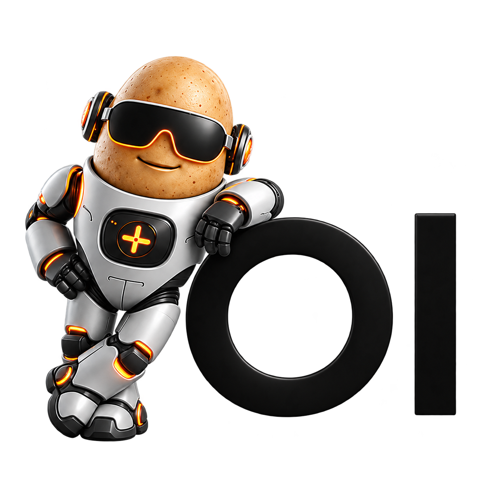

<p align="center">
  
</p>

# Tater Open WebUI

Tater Open WebUI is a terminal-first AI chat application derived from
[Open WebUI](https://github.com/open-webui/open-webui). It connects to Tater's
OpenAI-compatible API and gives the normal chat model unrestricted terminal
access inside the environment running Tater Open WebUI.

## What it does

- `tater/base` handles normal conversation and local computer work.
- Local work uses one model tool: `terminal({"command": "..."})`.
- `tater/hydra` is called only for Tater-owned capabilities such as connected
  devices, Verbas, Cores, Portals, media services, and automations.
- Terminal work stays local to Tater Open WebUI; it does not use Hydra or Spudex.
- The agent runs an inspect/edit/test loop and verifies completion before
  returning a final answer.
- Chat history, authentication, files, images, audio, and the terminal UI are
  retained from the Open WebUI foundation.

Both models use the standard Tater endpoint:

```text
POST {TATER_API_BASE_URL}/chat/completions
```

## Docker Compose

Requirements:

- Docker with Compose;
- a reachable Tater OpenAI-compatible API;
- a host directory that the agent is allowed to access.

```bash
cp .env.example .env
docker compose up --build
```

Open [http://localhost:3000](http://localhost:3000). The first account created
becomes the administrator.

The Compose setup mounts `TATER_WEBUI_HOST_PROJECTS` at `/projects`. Every
direct child directory becomes a Project in the sidebar, and files remain on
the host when the container is replaced.

## Projects

Projects replace the old chat-folder behavior. Each visible direct child of
`/projects` is discovered automatically, while creating or renaming a Project
in the UI creates or renames its real directory. A Project owns its chat list,
custom prompt, and shared working context. Individual chats retain their own
more specific context, and background terminal or Hydra tasks inherit the
Project that started them.

The selected Project is the terminal's default working directory. The agent
can still inspect and edit sibling directories under `/projects`, so one task
can coordinate changes across repositories when requested.

## Published image and Unraid

Every successful push to `main` publishes a tested Linux amd64 image:

```bash
docker pull ghcr.io/tatertotterson/tater-open-webui:latest
```

See the [Unraid guide](docs/UNRAID.md) for the complete container setup.

## Configuration

Configure the provider under **Admin settings → Tater** or with environment
variables on a new data directory.

| Variable                      | Default                    | Purpose                           |
| ----------------------------- | -------------------------- | --------------------------------- |
| `TATER_API_BASE_URL`          | `http://localhost:8501/v1` | Tater API prefix                  |
| `TATER_API_KEY`               | empty                      | Server-side Tater credential      |
| `TATER_BASE_MODEL`            | `tater/base`               | Normal chat and local agent model |
| `TATER_HYDRA_MODEL`           | `tater/hydra`              | Tater capability model            |
| `TATER_CONTEXT_WINDOW`        | `32768`                    | Configured model context tokens   |
| `TATER_HYDRA_TIMEOUT_SECONDS` | `600`                      | Hydra request timeout             |
| `TATER_AGENT_MAX_ITERATIONS`  | `32`                       | Maximum planning/tool rounds      |
| `ENABLE_TATER_FILE_LOG`       | `true`                     | Persist rotating application logs |
| `ENABLE_TATER_RUN_LEDGER`     | `true`                     | Persist structured agent events   |
| `TATER_RUN_LEDGER_MAX_BYTES`  | `52428800`                 | Bytes per run-ledger file         |
| `TATER_RUN_LEDGER_BACKUP_COUNT` | `10`                     | Rotated run-ledger files retained |
| `TATER_RUN_LEDGER_MAX_FIELD_CHARS` | `200000`               | Maximum stored size per text field |
| `TATER_PROJECTS_ROOT`         | `/projects`                | Persistent project directory      |
| `TATER_WEBUI_WORKSPACE`       | `/projects`                | Terminal fallback directory       |
| `TATER_WEBUI_HOST_PROJECTS`   | `./projects`               | Host path mounted at `/projects`  |

The API URL must point to the `/v1` prefix, not directly to
`/chat/completions`. Saving the Tater profile keeps the API key server-side,
sets the base model as the default, and reserves the Hydra model from ordinary
model selection. Set the context window to the maximum configured by the model
server. Tater Open WebUI compacts at 80 percent of that value, preserving the
remaining space for terminal instructions, tool results, and the response.

Hydra receives a self-contained task rather than the entire local transcript.
This avoids sending unrelated terminal output and local file contents to a
Tater capability call.

## Terminal behavior

Each user/chat pair has an independent working directory. A chat inside a
Project starts at that project's directory under `/projects`; it can still
inspect or edit sibling projects when requested. Commands inherit the
backend process environment, may use absolute paths, and return output plus
exit status in the same tool result. The model uses ordinary shell commands for
files, Git, packages, builds, tests, and process management.

## Background tasks

When a request needs the terminal or Hydra, Tater Open WebUI moves the work into
a background task. The original chat remains available while the task runs.
Active tasks appear above Chats in the sidebar, and opening one shows its live,
read-only transcript in the normal chat layout. Each step shows a concise
explanation plus the terminal command or Hydra request being executed. The
activity history is expandable, while full tool output stays in the existing
collapsed result sources.

The agent may show short progress updates while commands run. A completion
review prevents the task from ending while requested work is unfinished or its
answer is unsupported by actual tool results. Closing a task cancels it and its
active terminal process. When a task finishes or is cancelled, its outcome and
updated working context are returned to the chat that started it. Normal chat
also receives authoritative awareness of every currently running task. Up to
two background tasks may run for one user at a time.

## Persistent logs

The Docker data volume keeps two rotating diagnostic logs under
`/app/backend/data/logs`:

- `tater-open-webui.log` contains application messages, errors, and stack traces.
- `tater-agent-runs.jsonl` contains the complete agent event ledger, including
  planning attempts, progress, terminal or Hydra activity, sanitized results,
  timings, completion checks, context updates, and parent-chat delivery.

Every ledger line is JSON and includes a `run_id`; background work also includes
its `task_id` and originating `chat_id`. In both persistent logs,
credential-shaped keys, bearer tokens, command-line secrets, and URL passwords
are redacted. Very large fields and log files are bounded by the settings above
so command output cannot grow forever.

The ledger intentionally contains prompts, file excerpts, and command output.
Treat the data volume as sensitive; automatic redaction is a safety layer, not a
guarantee that arbitrary user-provided secrets can always be recognized.

## Development

Use Python 3.11 and Node.js 22.

```bash
npm ci
pip install -r backend/requirements.txt
npm run dev
```

In another terminal:

```bash
cd backend
./dev.sh
```

Run the regression suite and production build with:

```bash
python -m unittest discover -s backend/tests -p 'test_*.py'
npm run build
```

## Security

Terminal access is intentionally unrestricted for the operating-system user
running Tater Open WebUI. In Docker, that includes the container and every mounted
host path. Run it as a dedicated user, mount only intended directories, and put
remote access behind a trusted VPN or authenticated reverse proxy. See the
[security policy](docs/SECURITY.md).

## License

This project is a Tater-connected distribution of Open WebUI. It retains the
Open WebUI name and brand identity alongside Tater branding, as well as the
upstream license, historical license terms, notice, contributor agreement, and
copyright attribution. See `LICENSE`, `LICENSE_HISTORY`, `LICENSE_NOTICE`, and
`CONTRIBUTOR_LICENSE_AGREEMENT`.
